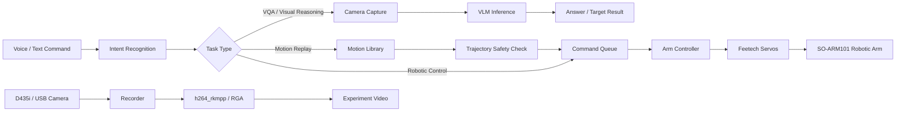

# RK3588-Based Edge-Side Embodied Intelligent Actuator

A lightweight edge-side embodied intelligence platform based on the Rockchip RK3588.  
The system integrates offline speech interaction, visual-language reasoning, leader-follower demonstration, motion-library replay, safety checking, and robotic-arm execution into a local closed-loop workflow.

> 中文简介：本项目是一套基于 RK3588 的端侧具身智能执行器，面向高校机器人教学、具身智能实验和桌面级自动化演示场景，实现“语音/文字指令 → 视觉理解 → 任务调度 → 机械臂执行”的本地化闭环。

---

## 1. Project Overview

This project is designed around an RK3588 edge-computing board and a 6-DOF SO-ARM101 robotic arm. It combines local multimodal inference, offline speech processing, trajectory recording/replay, and hardware-accelerated video recording.

The system is suitable for:

- embodied AI teaching and research;
- robotic-arm demonstration and motion-library construction;
- voice-driven visual question answering;
- simple tabletop grasping and placement experiments;
- offline AI education scenarios without cloud dependency.

---

## 2. Key Features

### Edge-side multimodal interaction

- Offline keyword wake-up, ASR and TTS based on `sherpa-onnx`.
- Text or voice command input.
- Local VLM reasoning through Qwen-based multimodal inference.
- Supports visual question answering and target description.

### Robotic-arm control

- SO-ARM101 6-DOF robotic arm control.
- Feetech serial servo communication.
- Cartesian-space motion command and direct joint-angle writing.
- Gripper control and emergency stop interface.

### Leader-follower demonstration and motion replay

- Reads the leader arm joint states.
- Converts servo pulse values into joint angles.
- Maps leader-arm motion to the follower arm.
- Records demonstration trajectories.
- Applies duplicate-frame removal, median filtering, velocity limiting and safety checking.
- Replays verified trajectories at a fixed frame rate.
- Stores stable motions in the motion library for later task calls.

### Motion-library management

- Record, inspect, delete and replay motion files.
- Supports voice or text command triggering.
- Supports loop replay, pause/continue and manual review.
- Provides reusable action templates for downstream VLM-assisted tasks.

### Vision and grasping

- Uses Intel RealSense D435i RGB-D camera.
- Combines visual-language recognition with depth information.
- Supports target localization and simple grasp/place demonstrations.
- Provides dry-run mode for safe testing before real execution.

### Hardware-accelerated experiment recording

- Uses FFmpeg with `h264_rkmpp` hardware encoder for video encoding.
- Can combine RGA hardware unit for scaling and OSD information overlay.
- Reduces CPU occupation during experiment recording.
- Useful for experiment replay, debugging and competition videos.

---

## 3. System Architecture



---

## 4. Hardware Requirements

| Module | Recommended Device |
|---|---|
| Edge computing board | RK3588 development board, 16 GB RAM recommended |
| Robotic arm | SO-ARM101 6-DOF robotic arm |
| Servo | Feetech STS3215 or compatible serial servo |
| Camera | Intel RealSense D435i RGB-D camera |
| Audio input | USB microphone |
| Audio output | Speaker or USB audio device |
| Connection | USB / TTL serial adapter |

---

## 5. Software Stack

| Layer | Technology |
|---|---|
| Operating system | Linux on RK3588 |
| Main language | Python 3.10 |
| Speech module | sherpa-onnx KWS / ASR / TTS |
| Vision module | OpenCV, pyrealsense2 |
| VLM inference | Qwen-based multimodal model, RKNN / RKLLM deployment |
| Arm control | LeRobot-style control interface, Feetech serial protocol |
| Video recording | FFmpeg, h264_rkmpp, scale_rkrga |
| Task scheduling | FIFO command queue and interrupt mechanism |

---

## 6. Repository Structure

The actual structure may vary slightly depending on the development branch.

```text
.
├── main.py                         # Main VLA entry
├── va.py                           # Voice assistant entry
├── config/                         # System configuration
│   ├── settings.py
│   ├── safety.py
│   └── teaching.py
├── vla/
│   ├── command_queue.py            # FIFO command queue and interrupt handling
│   ├── control/                    # Robotic-arm controller
│   └── vlm/                        # VLM loading and inference wrapper
├── voice_assistant/                # KWS / ASR / TTS module
├── scripts/
│   ├── develop_motion.py           # Demonstration recording and motion-library workflow
│   ├── record_trajectory.py        # Motion recording / list / inspect / delete
│   ├── smooth_trajectory.py        # Batch smoothing and trajectory validation
│   ├── replay_traj.py              # Trajectory replay
│   ├── vlm_grasp.py                # VLM-assisted grasping demo
│   ├── recorder.py                 # Hardware-accelerated video recording
│   └── task_controller.py          # Multi-step task controller
├── motion_library/                 # Recorded and verified motion files
├── task_library/                   # Multi-step task definitions
├── recordings/                     # Experiment videos
└── docs/                           # Project documentation
```

---

## 7. Installation

### 7.1 Clone the repository

```bash
git clone https://github.com/zizhennini/RK3588-Based-Edge-Side-Embodied-Intelligent-Actuator.git
cd RK3588-Based-Edge-Side-Embodied-Intelligent-Actuator
```

### 7.2 Create Python environment

```bash
conda create -n rk3588-eia python=3.10 -y
conda activate rk3588-eia
pip install -r requirements.txt
```

### 7.3 Check device connection

```bash
ls /dev/ttyACM*
ls /dev/video*
```

Update the serial port and camera index in the configuration file if necessary.

```python
SERIAL_PORT = "/dev/ttyACM0"
CAMERA_INDEX = 21
VLM_MODEL_PATH = "./models/Qwen3.5-0.8B"
```

### 7.4 Check RK3588 hardware encoding

```bash
ffmpeg -encoders | grep h264_rkmpp
ffmpeg -filters | grep rkrga
```

If `h264_rkmpp` or `scale_rkrga` is not available, install an RK3588-compatible FFmpeg build with Rockchip MPP/RGA support.

---

## 8. Quick Start

### 8.1 Start voice assistant

```bash
python3 va.py listen-forever
```

Single-round speech recognition:

```bash
python3 va.py once --seconds 4
```

Text-based interaction:

```bash
python3 va.py ask "介绍一下你自己"
```

Visual question answering:

```bash
python3 va.py ask "画面中有什么？" --no-speak
```

---

### 8.2 Motion-library management

List existing actions:

```bash
python3 scripts/record_trajectory.py list
```

Inspect one trajectory:

```bash
python3 scripts/record_trajectory.py inspect motion_library/greeting_01.json
```

Batch smooth and validate trajectories:

```bash
python3 scripts/smooth_trajectory.py
```

Replay a trajectory:

```bash
python3 scripts/replay_traj.py motion_library/greeting_01.json --port /dev/ttyACM0
```

---

### 8.3 Demonstration recording workflow

The recommended workflow is:

```text
leader-follower demonstration
        ↓
trajectory recording
        ↓
duplicate-frame removal
        ↓
median filtering
        ↓
velocity limiting
        ↓
safety checking
        ↓
manual review
        ↓
motion-library storage
        ↓
voice/text triggered replay
```

Run the motion development script:

```bash
python3 scripts/develop_motion.py
```

---

### 8.4 VLM-assisted grasping demo

Run in dry-run mode first:

```bash
python3 scripts/vlm_grasp.py "红色杯子" \
  --teach-trajectory grasp_01.json \
  --ref-cx 320 \
  --ref-cy 240 \
  --ref-z 0.3 \
  --dry-run
```

After confirming the output and safety check, remove `--dry-run` to execute the real robotic-arm motion.

---

### 8.5 Experiment recording

Basic recording:

```bash
python3 scripts/recorder.py --duration 5
```

Recording with OSD text:

```bash
python3 scripts/recorder.py --duration 5 --osd "Experiment Record"
```

The video will be saved to the `recordings/` directory by default.

---

## 9. Configuration

Common configuration items:

| Item | Description |
|---|---|
| `SERIAL_PORT` | Robotic-arm serial port |
| `SERIAL_BAUD` | Servo bus baud rate |
| `CAMERA_INDEX` | RGB camera index |
| `CAMERA_MATRIX` | Camera intrinsic parameters |
| `CAMERA_POSITION` | Camera position relative to arm base |
| `VLM_MODEL_PATH` | Local VLM model path |
| `VLM_IDLE_UNLOAD_TIMEOUT` | Idle timeout for unloading VLM |
| `VLM_MEMORY_BUDGET_MB` | Memory budget for VLM inference |
| `RECORDING_MEMORY_BUDGET_MB` | Memory budget for recording task |

Before real robotic-arm execution, check:

- joint direction;
- joint limit range;
- servo ID mapping;
- camera index;
- camera intrinsic and extrinsic parameters;
- workspace boundary;
- emergency-stop behavior.

---

## 10. Safety Notes

Robotic-arm execution can cause collision or hardware damage if the workspace is not calibrated correctly. Always follow these rules:

1. Test new trajectories in dry-run mode first.
2. Keep the robotic arm away from people during replay.
3. Check joint limits before writing servo commands.
4. Use low speed for first-time motion verification.
5. Make sure emergency stop is available.
6. Do not run autonomous grasping without camera calibration and manual supervision.

---

## 11. Current Development Status

| Function | Status |
|---|---|
| Offline KWS / ASR / TTS | Supported |
| Text / voice interaction | Supported |
| VLM visual reasoning | Supported, model path required |
| Leader-follower demonstration | Supported |
| Trajectory smoothing and replay | Supported |
| Motion-library management | Supported |
| VLM-assisted grasping | Experimental |
| Hardware video recording | Supported on RK3588 environment |
| RGA scaling and OSD overlay | Environment-dependent |
| Full autonomous general manipulation | Under development |

---

## 12. Roadmap

- Improve VLM output parsing and robustness.
- Add more grasping task templates.
- Improve camera-hand calibration workflow.
- Add more safety monitoring based on depth and servo current.
- Provide a web dashboard for classroom demonstration.
- Support more robot arms and end-effectors.
- Improve dataset export for imitation-learning experiments.

---

## 13. Academic and Educational Use

This project is mainly designed for teaching, research and competition demonstration. It can be used to help students understand:

- edge AI deployment;
- multimodal human-robot interaction;
- robotic-arm kinematics;
- trajectory recording and replay;
- embodied intelligence task pipeline;
- hardware acceleration on RK3588.

---

## 14. License

Please refer to the `LICENSE` file if it is provided in this repository.  
If no license is included, please add an appropriate open-source license before public distribution or reuse.

---

## 15. Acknowledgements

This project is built with inspiration from open-source robotics, edge AI and multimodal model deployment communities, including:

- Rockchip RK3588 ecosystem;
- LeRobot-style robotic-arm control;
- sherpa-onnx offline speech processing;
- FFmpeg Rockchip hardware acceleration;
- Intel RealSense RGB-D camera ecosystem.
