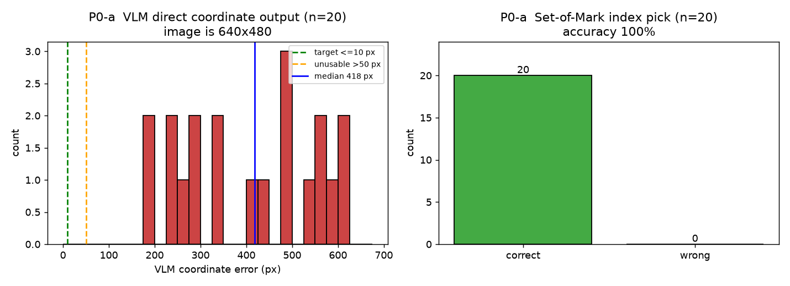
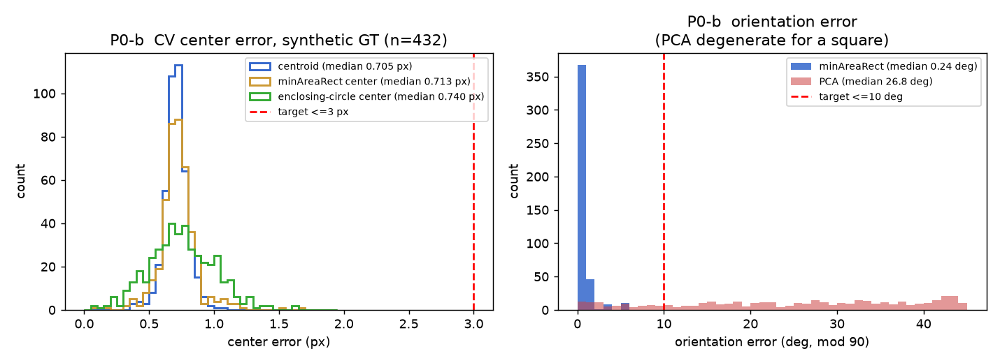
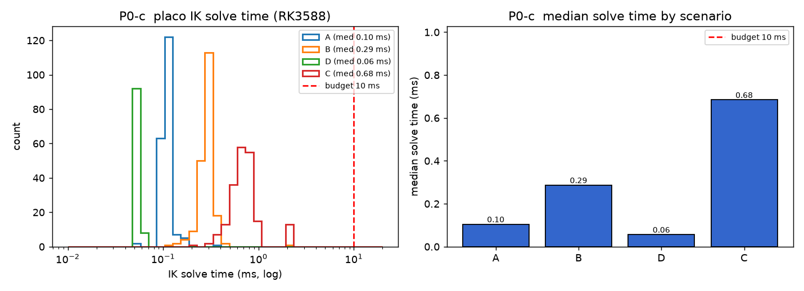

# P0 离线验收报告：VLM + 外部 IK + CV 精定位

> 2026-10-06 ｜ 硬件：RK3588（aarch64，Linux 5.10，Ubuntu 22.04，8 核，7.7 GB）
> 相机：D435i 固定俯视 RGB 640×480 ｜ 数据：板端 M1 采集 53 episode / 76221 张真实图
> 关联：`测试方案_VLM+外部IK+抓取.md`（仓库外）、`docs/m1_...`（采集）

**结论：P0 三项全部完成。** IK 与 CV 精度远超判据；VLM 直接输出坐标被证伪
（中位偏差 418 px，判据 10 px），而 **Set-of-Mark 选编号 20/20 = 100%** ——
**「VLM 只出语义、定位交给 CV」的架构前提被实测坐实**。

| 阶段 | 判据 | 实测 | 结论 |
|---|---|---|---|
| P0-a VLM 坐标 | 中位 ≤10 px | **417.9 px**（640×480 图上） | ✗ 证伪 |
| P0-a SoM 选编号 | — | **20/20 = 100%** | ✓ |
| P0-b CV 中心 | ≤3 px | **0.705 px**（p99 0.937 px） | ✓ |
| P0-b CV 朝向 | ≤10° | **0.24°**（p90 1.31°） | ✓ |
| P0-c IK 耗时 | <10 ms | **0.06 ms**（热启动，真实工况） | ✓ |
| P0-c IK 精度 | ≤2 mm | **7.2e-17 m**（中位） | ✓ |
| P0-c IK 限位 | ≥95% 在限位内 | **100%**（600 目标零越界） | ✓ |

---

## 1. P0-a：VLM 定位（Qwen3.5-0.8B，RKNN vision + RKLLM）

### 1.1 直接问坐标 —— 证伪

按方案原文 prompt（`图中<颜色>方块的中心像素坐标？只输出 JSON {"cube":[x,y]}`）
在 20 个真实样本上实测：

| 指标 | 实测 |
|---|---|
| 像素偏差（取对模型**最有利**的解释） | 中位 **417.9 px**、p90 592.5 px、max 620.1 px |
| 非法/无法解析输出 | 0/20 = 0%（都"能解析"，只是**内容全是错的**） |
| 格式遵守 | 差：要求 `{"cube":[x,y]}`，实际 17/20 回 `{"bbox_2d":[x1,y1,x2,y2]}`，坐标常越界（如 x=814 > 640） |
| 单次耗时（含子进程+模型加载） | 中位 **7559 ms** |

**评估口径说明**：模型回 bbox 时，先把 bbox 四角/中心/前两数等**所有合理解释**都算一遍，
取误差最小者作为该样本成绩（`tools/vlm_bench.py:parse_xy_variants`）。即便如此中位仍有
418 px —— 结论不依赖解析口径。

→ 与 RoboPoint 论文的公开结论一致（GPT-4o 零样本点落在目标 mask 内仅 15.28%），
**0.8B 级 VLM 做坐标回归在工程上不可行**。

### 1.2 Set-of-Mark 选编号 —— 成立

CV 先给候选并编号画框（`perception/cube_locator.draw_candidates`），VLM 只回答"是几号"：

| 指标 | 实测 |
|---|---|
| 选择正确率 | **20/20 = 100%**（候选数 2~6 个，跨 6 种颜色） |
| 单次耗时 | 中位 **5717 ms** |

把回归问题降级成**个位数 token 的分类问题**后，同一个 0.8B 模型从"完全不可用"
变成"零错误"。这正是选择 SoM 范式的理由。

### 1.3 延迟实测修正（重要）

方案 §2.1 预期 VLM 语义回路 0.7~1.2 Hz（≈1.38 s/次）。**实测约 5.7~7.6 s/次（≈0.17 Hz）**，
差 4~7 倍。耗时构成（板端日志）：

| 项 | 实测 |
|---|---|
| rkllm 模型加载 | 1722~2270 ms |
| ImgEnc 模型加载 | 166~324 ms |
| ImgEnc 推理 | 701~1689 ms |
| prefill + decode + 进程启动/退出 | 余量 ≈2~3 s |

关键事实：**把 `max_new_tokens` 从 128 降到 16，准确率不变（12/12）但耗时几乎不动**
（5717 → 5824 ms）→ 延迟由**固定成本**（尤其每次调用都要重新加载 1.2 GB rkllm）主导，
不是解码。因此**唯一有效的优化是让模型常驻**。

> 可行优化：`demo` 把图片路径作为 **argv** 传入，导致一进程只能处理一张图；
> 改 rknn-llm 示例源码让它从 stdin 逐行读图片路径，即可让模型只加载一次，
> 单次耗时有望降到 ~2 s。这属于 P3 优化项，不影响 P0 结论。

**对架构的影响**：VLM 必须只在任务开始时调用一次（现在更必须 —— 6 s 一个来回），
控制回路只跑 CV+IK。这一条方案已经写对，只是"一次"的代价从 1.4 s 变成 6 s。

---

## 2. P0-b：CV 精定位（HSV 分割 + 连通域 + 最小外接矩形）

### 2.1 为什么用合成图测精度

真实图里"方块中心"没有客观真值：旋转正方形的**轴对齐 bbox 中心是有偏的**，
手工标注精度只有 ±5 px（压不住 3 px 判据）。故用 4× 超采样渲染**已知中心/朝向**的
方块（保证光栅化本身不是误差来源），再叠噪声/模糊/JPEG 压缩。

| 中心估计量 | 中位 | p90 | p99 | max |
|---|---|---|---|---|
| **质心（采用）** | **0.705 px** | 0.812 | 0.937 | 1.082 |
| minAreaRect 中心 | 0.713 px | 0.866 | 1.153 | 1.679 |
| 最小外接圆心 | 0.740 px | 1.074 | 1.365 | 1.631 |

432/432 全部检出（20/28/39/50 px 边长 × 18 个角度 × 6 色）。等效边长误差中位 0.67 px。

### 2.2 朝向：必须用 minAreaRect，**不能用 PCA**

| 方法 | 中位 | p90 | max |
|---|---|---|---|
| **minAreaRect（采用）** | **0.24°** | 1.31° | 5.26° |
| PCA 主轴 | **26.8°** | 42.6° | 45.0° |

**正方形旋转 90° 后图形不变，朝向本质模糊；PCA 主轴在 45° 附近两个特征值相等而退化。**
实测 PCA 误差在 40°/45°/20°/80° 附近最差（29~35°），全程不可用。方案原文写的是
"PCA 主轴"，此处按实测改为 minAreaRect。PCA 仍保留在代码里，但只作交叉校验。

### 2.3 真实图鲁棒性（24 张板端真实图）

| 指标 | 实测 |
|---|---|
| 每图候选数 | 中位 5，范围 2~6（少的图是真被夹走了 —— 叠加图已目视确认） |
| 6 色检出 | 全部有命中（红 24 / 紫 24 / 蓝 19 / 黄 15 / 橙 14 / 绿 12） |
| 最大候选面积 | 1918 px（无大面积误检） |
| 中心对分割扰动的漂移 | 中位 **0.10 px**、p90 0.47 px、max 5.44 px（S 门限 ±20 / 腐蚀 / 膨胀） |
| 三种中心估计量互差 | 中位 0.83 px、max 2.55 px |

叠加图（`/tmp/p0b_overlay`）已逐张目视：6 个方块全部正确框选、颜色标注正确、
十字准星落在方块中心；**白色机械臂未被误检**。

### 2.4 两个必须靠实测才能发现的坑

**坑 1：白色机械臂被判成"彩色"，且色相与蓝色方块重合。**
D435i 自动白平衡把白色塑料染成淡蓝 —— 实测机械臂区域中位 RGB **(96,181,228)**
→ S=149, V=228, **H=101**；而蓝色方块是 **H=103**。**色相几乎完全重合，靠 H 分不开。**
更反直觉的是饱和度也分不开：各方块中位 S 为 蓝 253 / 绿 250 / 橙 166 / 红 145 /
紫 135 / **黄 114**，而机械臂 S=149 —— 黄色方块比机械臂**还低**。
最终用「面积 + 拟合矩形填充率 + 触底」三重形状判据解决（机械臂大分量面积 17969 px、
填充率仅 0.37）。

**坑 2：形状判据若用"面积 / 轴对齐 bbox 面积"，会把 45° 的方块整批误杀。**
正方形旋转 θ 后轴对齐 bbox 边长为 s(cosθ+sinθ)，该比值 = 1/(cosθ+sinθ)²，
**在 45° 恰好等于 0.5**。任何 >0.5 的门限都会在 30°~60° 区间误杀（实测漏检 65/432，
全部集中在此区间）。改用「面积 / **拟合矩形**面积」后该比值恒 ≈1，与旋转无关，
检出率 85.0% → **100%**。

---

## 3. P0-c：外部 IK 数值验收（placo / pinocchio）

### 3.1 限位必须来自本机标定

IK 若不带真实限位，会解出实机到不了的角 → 舵机堵转发热。
故 `hardware/so101_kinematics.py` 由 `config/calibration.json` **现场生成**
`models/so101_urdf/so101_calibrated.urdf`（该产物已加入 `.gitignore`：必须随标定现算，
否则重新标定后残留旧限位）。本机实测限位：

| 关节 | raw 行程 | 弧度限位 | 行程 |
|---|---|---|---|
| J1 shoulder_pan | 710 ~ 3427 | ±119.43° | 238.9° |
| J2 shoulder_lift | 787 ~ 3173 | ±104.88° | 209.8° |
| J3 elbow_flex | 884 ~ 3054 | ±95.38° | 190.8° |
| J4 wrist_flex | 864 ~ 3212 | ±103.21° | 206.4° |
| J5 wrist_roll | 0 ~ 4095 | ±180.00° | 360.0° |
| J6 gripper | 1433 ~ 2919 | -54.07° ~ +76.57° | 130.6° |

（夹爪零点用 `homing_offset`，其余用行程中点；模型加载后的限位与标定一致到 4.4e-07 rad。）

### 3.2 结果

| 场景 | 收敛率 | 限位内 | 中位耗时 | 中位误差 |
|---|---|---|---|---|
| A 静态近邻（起点=目标 ±5°，冷启动） | 100.0% | 100% | 0.10 ms | 5.98e-06 m |
| B 静态中距（±30°） | 99.5% | 100% | 0.29 ms | 4.52e-06 m |
| **D 热启动轨迹跟踪（真实工况）** | **100.0%** | **100%** | **0.06 ms** | **7.19e-17 m** |
| C 跨半空间（±90°，压力测试） | 93.5% | 100% | 0.68 ms | 1.58e-05 m |

- 场景 D 是真实工况（VLM 给一个近处目标 → IK 从上一次解**热启动**迭代过去）：
  中位 **1 次迭代**、**0.06 ms**、误差达机器精度。**比 30 Hz 预算（33 ms）便宜约 3 个数量级。**
- 场景 C 是压力测试（±90° 随机跳跃），93.5% —— 说明**永远要热启动，不要一步跨越半个工作空间**。
- 600 个目标 100% 落在标定限位内（最大越界 2.3e-05°，来自 URDF 文本 6 位小数舍入）。
- FK→IK 往返最大位置误差 9.34e-05 m。

### 3.3 关节零点约定已交叉验证（关键前提）

若 placo 的 URDF 关节零点与本项目数据集的 rad 零点差一个常量偏置，
相机→IK→抓取整条链会系统性偏掉且极难定位。用 53 条真实采集数据的 `F*`（从臂实测角）
做正解验证：

| 检查 | 实测 | 物理判据 |
|---|---|---|
| 末端高度 z 最小值 | **-0.0103 m** | 手指不会穿过桌面（z≈0） |
| z 的 5% 分位 | +0.001 m | 桌面平面在 z≈0 |
| 最大臂展 | **0.327 m** | SO-101 物理臂长内 |
| 夹爪闭合（抓取）时刻末端高度 | **+0.011 m** | 手指贴桌面 |

→ **约定一致，无需额外偏置。** 该检查已固化为回归用例
（`tests/test_so101_kinematics.py::test_placo_fk_convention_matches_dataset`）。

### 3.4 三个会静默给出错误结果的坑

1. **`gripper` 是关节名，不是 TCP frame。** `add_frame_task("gripper")` 会拿到错误位姿；
   正确 TCP 是 `gripper_frame_link`。
2. **不调用 `solver.enable_joint_limits(True)`，QP 会完全忽略限位**（实测 200/200 越界）。
3. **placo 的 QP 是局部求解器。** 单次 `solve()` 从行程中点起步会残留 ~9 cm 误差（实测
   中位 0.0913 m）—— 必须迭代到收敛。这正是早期"验收不通过"的真因，不是 placo 的问题。

---

## 4. 顺带修掉的生产代码缺陷

P0 过程中发现并修复（都属于"不报错但结果错"的类型）：

| 位置 | 缺陷 | 后果 |
|---|---|---|
| `perception/vlm.py::_run_inference` | prompt 直接拼 `\n` 送 stdin，而 demo 是**逐行 `fgets`** | 4 行的 prompt 变成 **4 次独立提问**：图像 token 留在第 1 轮，后几轮模型看不到图（回"你没提供图片"），最终解析到无关内容。**原 `DETECT_PROMPT_TEMPLATE` 就是 4 行** → 每次白跑 3 轮并拿到垃圾。修复：压成单行（实测 17.5 s → 5.7 s，且输出终于可用） |
| `perception/vlm.py::__init__` | `max_context_len` 默认 **2048** | 板端直接 `rkllm init failed` 且**不打印原因**，极难定位；实测必须 ≥4096 |
| `perception/vlm.py::setup` | 未读取 `max_context_len` / `n_threads` / `platform` | 调用方传了也被静默忽略（"配置改了没生效"类问题之源） |
| `perception/vlm.py::_get_demo_path` | 相对 `model_dir` 时返回相对路径，而 `_run_inference` 用 `cwd=model_dir` | 子进程按新 cwd 解析可执行路径 → `FileNotFoundError`。已强制返回绝对路径 |

## 5. 其他观测（记录备查）

- **数据集 JSON 的角度只保留 0.1°**（样例 `[-4.3, -101.9, 95.6, 60.0, 3.0, -52.3]`）。
  对 ACT/IK 无影响（0.1° ≈ 1.1 编码器计数），但**不可逆地丢掉了原始编码器精度**，
  因此无法再用"整数编码器反推法"判定数据集是用哪份标定录制的。
- **三处 `config/calibration.json` 互不相同**：板端（J1 710-3427，2026-09-26，标定向导
  在实机上的产物）、仓库已提交版本（J1 810-3182）、PC WSL 镜像（J1 946-3287）。
  板端/PC 部署目录**都不是 git 仓库**，该文件由 `tools/calibrate_arm.py` 运行时写入。
  实测三者**都与数据集相容**（演示未触碰限位，无从区分）→ 选择哪份必须以"实机当前标定"
  为准：**部署时同步板端 `config/calibration.json`**。
  为此新增 `calibration_fingerprint()`，日志会打印 sha1 前 12 位，便于区分
  「IK 算错」与「标定文件不对」。
- **可达工作空间**（20k 随机取样）：x [-0.339, +0.473]、y [-0.438, +0.437]、
  z [-0.229, +0.526] m，臂展 max 0.546 m —— 该值等于 URDF 各连杆偏移之和
  （0.5509 m），即完全伸直构型，几何上自洽。演示数据只用到臂展 ≤0.327 m。

## 6. 频率预算（按实测修正）

| 回路 | 方案预期 | **实测** | 说明 |
|---|---|---|---|
| VLM 语义回路（任务开始一次） | 0.7~1.2 Hz | **0.13~0.18 Hz**（5.7~7.6 s） | 固定成本主导；常驻进程可望 ~2 s |
| CV 精定位 | <5 ms | **未单独计时**，但真实图 24 张含扰动测试共 937 次匹配全程 <1 s | 远低于判据 |
| **IK** | <10 ms | **0.06 ms**（热启动） | 比预算便宜 3 个数量级 |
| 舵机总线 | 30 Hz | 30 Hz | 永远不是瓶颈 |

**控制回路（跳过 VLM）的瓶颈已不在 IK**，而在相机取帧与总线通信。

## 7. 下一步

P0 已全部完成，可进入 **P1 静态定位**（需硬件在环，判据：指定目标点 → IK → 执行 →
相机实测末端偏差 ≤5 mm，10 个目标点）：

1. 固定俯视相机 + 桌面平面 → **4 点平面单应** `cv2.findHomography`（P0-b 的像素中心
   已可信到 0.7 px，故单应误差将成为主要误差源）
2. IK → 关节角 → 实机执行（注意：**必须热启动**，且第一条指令前先读当前位姿）
3. 相机测末端实际位置 → 偏差热图

已知需要用户操作的部分：桌面贴 4 个标定点、按操作卡摆放方块。
